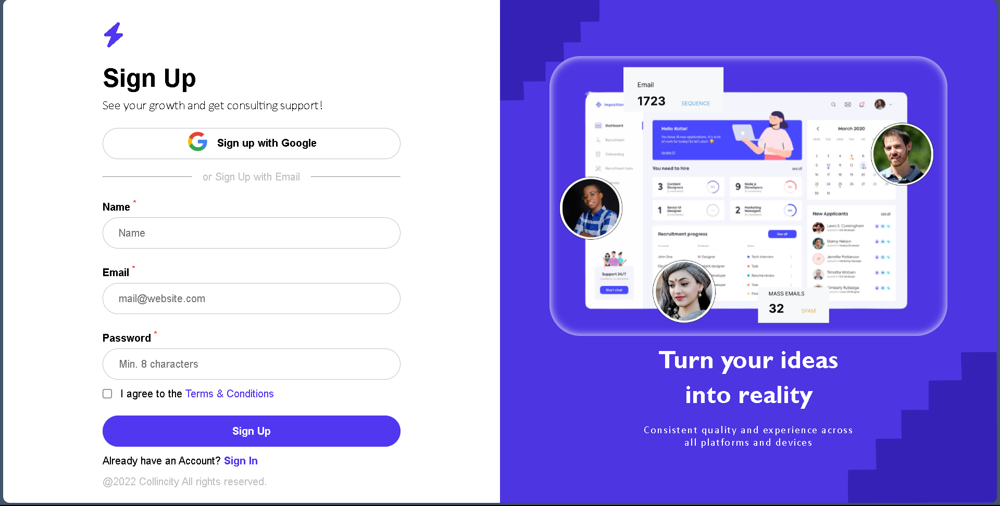
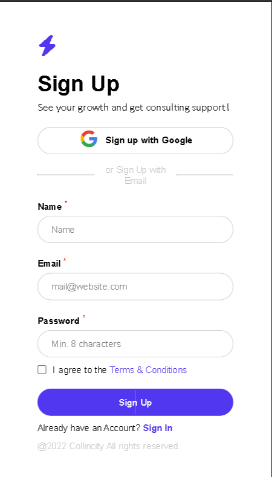

# One-Page Sign-Up Form: FormKit

[](LICENSE)

A sleek and responsive one-page sign-up form template named "FormKit." Built with HTML, CSS, and JavaScript – no frameworks or libraries involved.

## Table of Contents
- [Overview](#overview)
- [Features](#features)
- [Preview](#preview)
- [Getting Started](#getting-started)
- [Usage](#usage)
- [Contributing](#contributing)
- [License](#license)
- [Contact](#contact)

## Overview

"FormKit" is a frontend project offering a streamlined and visually appealing sign-up form. Crafted with HTML, CSS, and JavaScript, it provides a modern and responsive user interface for both mobile and web views.

## Features

- **Simplicity:** A straightforward sign-up form designed for ease of use.
- **Responsiveness:** Ensures a seamless experience across various devices.
- **Good-Looking UI:** Delivers an aesthetically pleasing user interface.

## Preview




For a closer look, check out the [live demo](https://okafor-chiagozie.github.io/FormKit) or clone the repository and open the `index.html` file in your web browser.

## Getting Started
1. Clone the repository
   ```bash
   git clone https://github.com/Okafor-Chiagozie/FormKit.git
   ```
2. Navigate to the project directory
   ```bash
   cd project-directory
   ```
3. Open the `index.html` file in your preferred web browser.
   
## Usage
Explore the simplicity and responsiveness of the FormKit template. Customize it to fit your project's sign-up needs, providing users with a clean and efficient registration experience.

## Contributing
- Fork the repository
- Create a new branch 
   ```bash
   git checkout -b feature/your-feature
   ```
- Make changes and commit 
   ```bash
   git commit -m 'Add some feature'
   ```
- Push to the branch 
   ```bash
   git push origin feature/your-feature
   ```
- Open a pull request

## License
This project is licensed under the MIT License - see the [LICENSE](LICENSE) file for details.

## Contact
Feel free to contact me at [ collincity111@gmail.com ] for any inquiries or feedback.